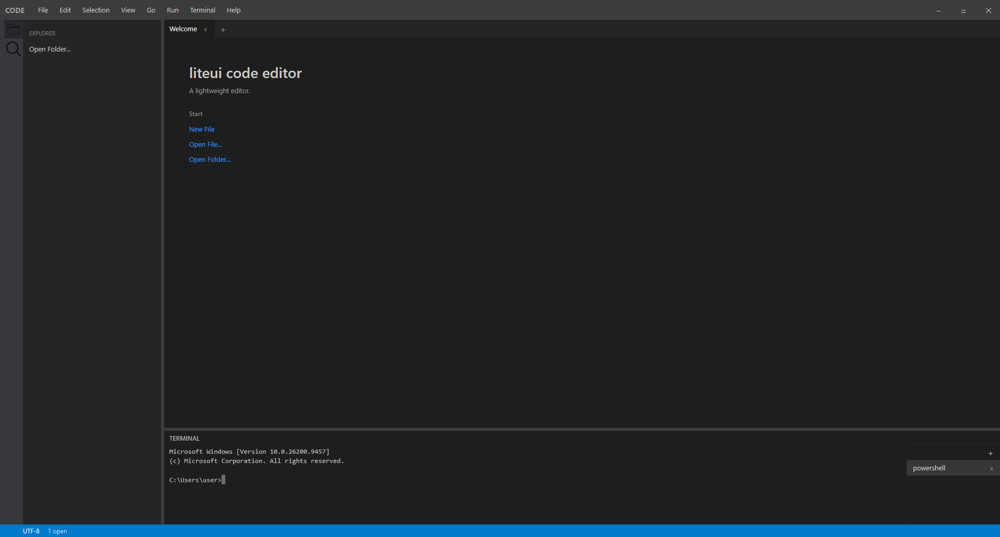
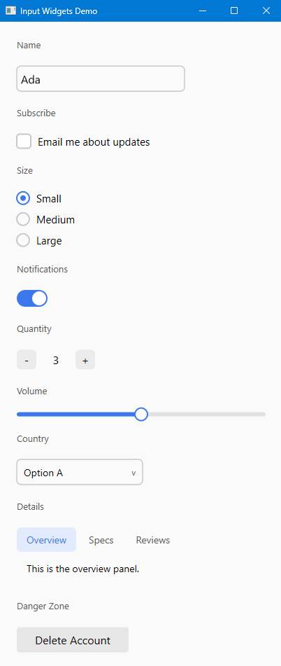
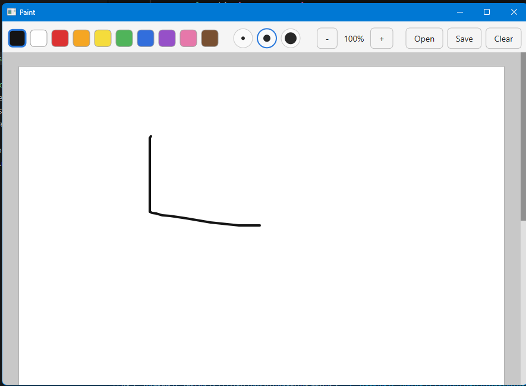

# liteui

A single-header, retained-mode GUI library for C++23. One compiled definition per build via `#ifdef` — native
rendering on both platforms (Direct2D/DirectWrite on Windows,
Wayland/EGL/Cairo/Pango on Linux).

```cpp
#include "liteui.hpp"

int main() {
  int count = 0;

  Text label;
  label.label = [&]() { return "Count: " + std::to_string(count); };
  label.fontSize = 20;

  View button;
  button.style.width = Size::pixel(140);
  button.style.height = Size::pixel(44);
  button.style.borderRadius = 6.0f;
  button.style.backgroundColor = Color{230, 230, 230};
  button.style.hoverColor = {210, 210, 210};
  button.style.alignItems = Align::Center;
  button.style.justifyContent = Justify::Center;
  button.onClick = [&]() { count++; };

  Text buttonLabel;
  buttonLabel.label = "Increment";
  button.addChild(buttonLabel);

  View root;
  root.style.direction = FlexDirection::Column;
  root.style.alignItems = Align::Center;
  root.style.justifyContent = Justify::Center;
  root.style.gap = 16;
  root.style.width = Size::full();
  root.style.height = Size::full();
  root.addChild(label);
  root.addChild(button);

  LiteUI ui("Counter", 400, 200);
  ui.setRoot(root);
  ui.run();
}
```

## Screenshots

| Code editor | Input widgets | Paint |
|---|---|---|
|  |  |  |

## What's in the header

- A retained `View` tree with a flexbox-subset layout engine — `Size`
  (Fixed/Percentage/Fit/Full), row/column direction, wrap,
  justify/align-content, absolute positioning, and per-axis
  overflow/scrolling with real scrollbars.
- `Text` and `Canvas` leaf nodes. Canvas exposes an HTML5-canvas-style
  2D drawing API (paths, gradients, shadows, composite operators,
  image draw/get/put) backed by Direct2D on Windows and Cairo on Linux.
- `TextInput`, `Image`, and `Svg` convenience nodes built on top of
  `Canvas` — a single-line text field with caret/selection, an
  `object-fit`–aware image node (PNG/JPEG decoding included), and a
  small dependency-free SVG parser/renderer.
- `Dynamic<T>` — every meaningful style/content field can be a plain
  value or a `std::function<T()>` polled once per dispatch cycle, so
  `label.label = [&]{ return someState; };` just works without a
  virtual-DOM diffing layer.
- Keyed dynamic list children (`keysSource` / `itemBuilder`) for
  todo-app-style add/remove where only the changed subtree rebuilds.
- Mouse, keyboard, focus, tooltips, clipboard, native file/folder
  pickers, and a custom client-side titlebar on Linux (Windows uses
  native decorations).

See [`docs/PLATFORM_NOTES.md`](docs/PLATFORM_NOTES.md) for the current
list of known per-backend limitations (gradients, shadows, `getImageData`,
SVG feature coverage, etc.) before relying on any of the above.

## Supported platforms

| Platform | Rendering | Windowing |
|---|---|---|
| Windows | Direct2D + DirectWrite | Win32 |
| Linux | Cairo/Pango (2D + text) + EGL/GLES2 (compositing) | Wayland (xdg-shell) |

There is no X11 backend and no macOS backend at this time.

## This is not a zero-dependency header

Unlike `stb_*.h`, `liteui.hpp` talks directly to each platform's native
GUI/graphics stack, so linking against system libraries is required —
`#include`-ing the header alone is not enough to build. This is closer
to how GLFW or Dear ImGui's platform backends work than to stb.

| Platform | Required libraries |
|---|---|
| Windows | `user32`, `gdi32`, `d2d1`, `dwrite`, `windowscodecs`, `ole32` |
| Linux | `wayland-client`, `wayland-cursor`, `wayland-egl`, `cairo`, `pangocairo`, `egl`, `glesv2`, `xkbcommon`, `libpng`, `libjpeg` (all resolvable via pkg-config) |

## Getting started

### With CMake (recommended)

```cmake
add_subdirectory(path/to/liteui)   # or FetchContent_Declare + FetchContent_MakeAvailable
target_link_libraries(your_app PRIVATE liteui::liteui)
```

The `liteui::liteui` target already carries the include directory, the
C++23 requirement, and every platform link library above — you don't
need to write your own `find_package`/`pkg_check_modules` calls.

On Linux, the Wayland protocol bindings (`xdg-shell`,
`xdg-decoration`) are pre-generated and checked into
`platform/wayland-protocols/`, so building liteui does **not** require
`wayland-scanner` or the `wayland-protocols` package — only the
runtime libraries in the table above.

#### "vendored Wayland protocol sources not found"

If you see this error, it means you're building from a checkout where
`platform/wayland-protocols/*.c`/`*.h` haven't been generated yet
(e.g. a fresh clone before they were committed, or you're building
liteui itself for the first time rather than just consuming it as a
dependency). Fix it once:

```bash
sudo apt install libwayland-bin wayland-protocols   # provides wayland-scanner + the protocol XML
cmake -B build      # configures with a WARNING instead of failing, once wayland-scanner is found
cmake --build build --target regen-protocols
git add platform/wayland-protocols && git commit
```

After that one-time step, `platform/wayland-protocols/` is populated
and committed, and every subsequent `cmake -B build` configures
cleanly without needing `wayland-scanner` or `wayland-protocols`
installed at all.

### Without CMake

Add `liteui.hpp` to your include path and link the libraries from the
table above manually. On Linux you'll also need to compile
`platform/wayland-protocols/xdg-shell-protocol.c` and
`platform/wayland-protocols/xdg-decoration-protocol.c` into your build
— they're plain C files, no code generation needed at your end.

## Examples

Every file under [`examples/`](examples/) is a small, focused, single
file program demonstrating one feature (text input, image loading,
menus, split panes, a paint canvas, a file explorer, etc.).

```bash
cmake -B build -S .
cmake --build build --target counter
./build/examples/counter          # build/examples/Debug/counter.exe on multi-config generators
```

Swap `counter` for the name of any file under `examples/` (its target
name matches the filename without `.cpp`).

## License

See [`LICENSE`](LICENSE).